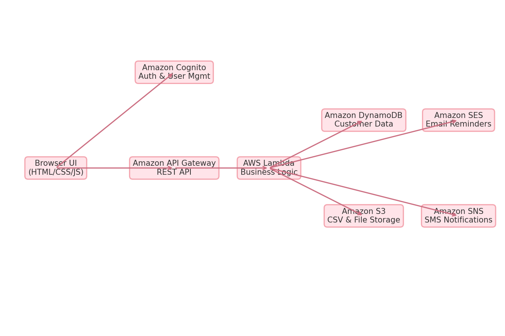

# consultant-crm
Many consultants keep customer info scattered across spreadsheets, emails, and sticky notes. This tool will:  Store customer contact info, Track purchases or project history, Allow follow-up scheduling and notes, Give a quick dashboard overview.

##  Overview
This is a lightweight client management tool built entirely with HTML, CSS, and JavaScript.  
It is designed for **solo founders, consultants, and microbusiness owners** who need an easy way to store, search, and manage client information without paying for complex CRM software.

The MVP runs entirely in the browser using `localStorage` — perfect for quick demos, proof-of-concept builds, and offline-first workflows.  

**Key Features:**
-  Add, edit, and delete customer records
-  Instant search by name, company, or email
-  Track next follow-up dates
-  Dashboard stats for customer count, upcoming follow-ups, and deals in negotiation
-  Export customer data to CSV
-  Import customer data from CSV (bulk add/update)
-  Soft, modern UI aesthetic

---

## Business Case
Small business owners often:
- Struggle to keep track of client details across notebooks, spreadsheets, and email threads
- Don’t have the budget or tech skill to set up enterprise CRMs
- Need something **quick to deploy, easy to use, and portable**

This CRM solves that by:
- Running in any modern web browser
- Requiring **zero installation or setup**
- Offering CSV import/export to sync with Excel, Google Sheets, or larger CRMs later

---

## Tech Stack
- **Frontend:** HTML5, CSS3, Vanilla JavaScript
- **Storage:** Browser `localStorage` (no server required for MVP)
- **Data Portability:** CSV Import/Export
- **Hosting:** Works on GitHub Pages, Netlify, AWS Amplify, S3 + CloudFront

---

## AWS Migration Plan
While this MVP uses localStorage, it’s **designed for a smooth migration to AWS** for production use.

### 1️⃣ Authentication & User Management
- **AWS Cognito** → Sign-up/sign-in, multi-user accounts, secure data separation

### 2️⃣ Backend API
- **Amazon API Gateway** → Create secure API endpoints for CRUD operations
- **AWS Lambda (Node.js/Python)** → Serverless functions to handle business logic

### 3️⃣ Data Storage
- **Amazon DynamoDB** → NoSQL database for scalable customer record storage
- **Amazon S3** → Store CSV imports/exports and other files securely

### 4️⃣ Notifications & Follow-ups
- **Amazon SES** → Automated follow-up reminder emails
- **Amazon SNS** → Optional SMS reminders

### 5️⃣ Hosting & Delivery
- **Amazon S3 + CloudFront** → Global CDN hosting for the web app
- **AWS Amplify** → Optional alternative for CI/CD and hosting

### 6️⃣ Infrastructure as Code
- **AWS CDK** (Cloud Development Kit) → Provision all services programmatically for repeatable deployments

## ☁️ High-Level AWS Architecture

---

## Setup & Usage
1. Download or clone the repo
2. Open `index.html` in any browser
3. Add, edit, search, and export/import customer records
4. Deploy to GitHub Pages, Netlify, or AWS S3 + CloudFront

---

## Future Enhancements
- Multi-user accounts with AWS Cognito
- Cloud sync with DynamoDB backend
- Automated follow-up reminders via SES/SNS
- Analytics dashboard for customer trends
- Role-based permissions for team use

---

## About the Developer
**Ashley Enjoli** — Small Business Consultant, Entrepreneur, and aspiring AWS Solutions Architect.  
Passionate about building tools that help small business owners work smarter, not harder.  

Connect on [LinkedIn](https://linkedin.com/in/ashley-enjoli) or view my [Portfolio](https://ashleyenjoli.com).

